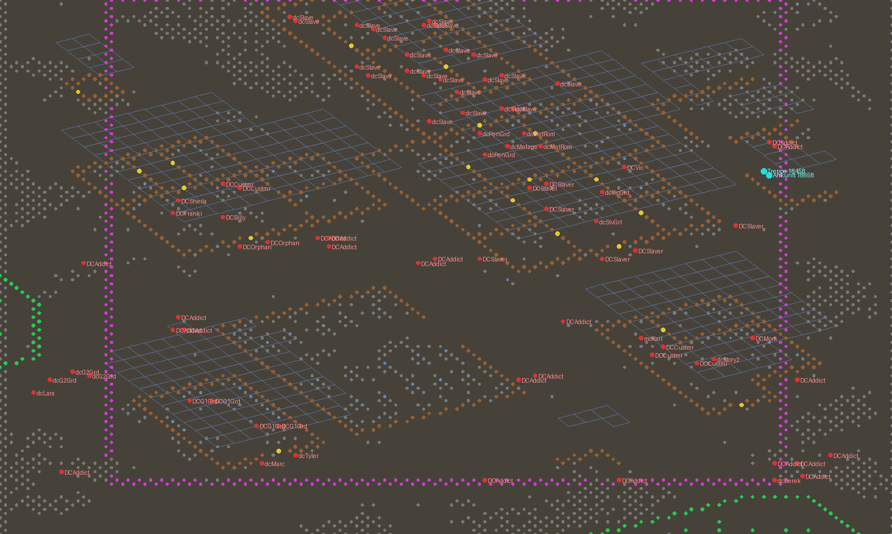
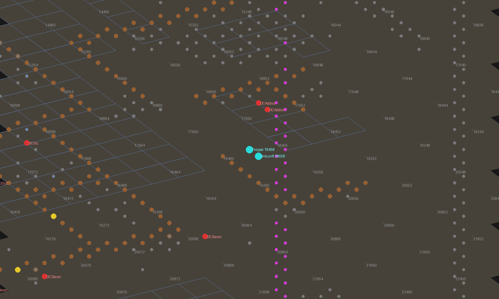
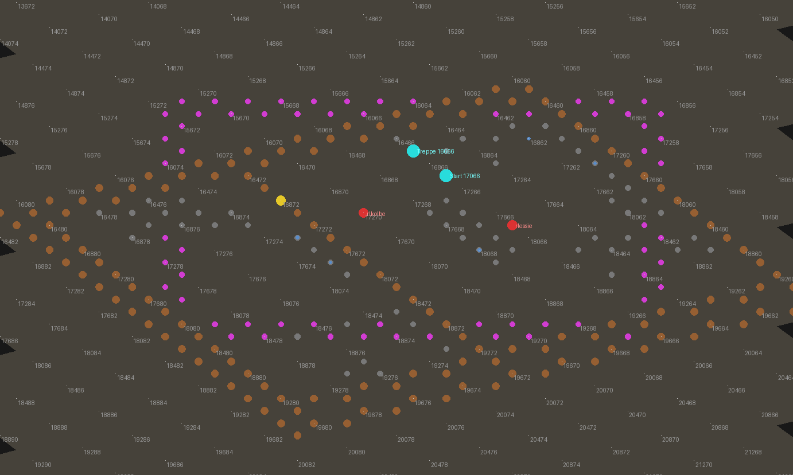

# Umsetzung 2 – Die Gosse: Eingang in der Den und Innenkarte RLDEN01

**Arbeitstitel:** *Rotlicht über dem Ödland* – Addon-Modifikation für Fallout 2
**Status:** Umgesetzt und automatisch geprüft, aber **nicht im Spiel gesehen**, weil hier keine Spielgrafiken vorliegen:
- Die Skripte kompilieren gegen das Restoration Project (RPU) und den Unofficial Patch, mit und ohne Debug.
- Die Karte entsteht aus Beckys Keller im RPU, und das Werkzeug liest sie byte-gleich wieder ein.
- Die Sichtprüfung im Spiel übernimmst du mit der Prüfliste in Abschnitt 5.

**Grundlage:** [Phase 2](phase-2-standorte-und-ausbau.md) (Abschnitt 2.1, Map `RLDEN01`), [Phase 5](phase-5-technik.md) (Abschnitt Karten), [Umsetzung 1](umsetzung-1-prolog-und-ausbau.md) (Essie und Kolbe).

---

## 1. Was neu ist

| Datei | Inhalt |
|---|---|
| [`tools/fomap.py`](../tools/fomap.py) | **neu:** liest und schreibt Fallout-2-Karten (.MAP, Version 20). Alle 174 Karten des RPU liest es byte-gleich wieder ein |
| [`tools/fomap_bild.py`](../tools/fomap_bild.py) | **neu:** schematische Draufsicht einer Karte als PNG (Wände, Türen, Figuren, Scroll-Grenzen, Hexnummern) |
| [`tools/data/proto_extra.json`](../tools/data/proto_extra.json) | **neu:** Untertypen von 2.339 Protos, die `fomap.py` beim Lesen der RPU-Karten gelernt hat. Damit braucht es die Protos aus `master.dat` nicht. 390 davon lassen sich gegen die Protos im RPU-Repository prüfen, und alle stimmen |
| [`tools/bau_karten.py`](../tools/bau_karten.py) | **neu:** alle Kartenpositionen an einer Stelle. Baut `rlden01.map`, erzeugt `rl_karten.h` und die Bilder unten |
| [`scripts_src/headers/rl_karten.h`](../scripts_src/headers/rl_karten.h) | **neu, erzeugt:** Hexfelder und PIDs für die Skripte |
| [`scripts_src/rotlicht/rlgosse.ssl`](../scripts_src/rotlicht/rlgosse.ssl) | **neu:** die Kellertreppe auf Den Business 2 (Ansehen, Benutzen → RLDEN01) |
| [`scripts_src/rotlicht/rlden01.ssl`](../scripts_src/rotlicht/rlden01.ssl) | **neu:** Kartenskript der Gosse (Kellerlicht, Satz beim ersten Besuch) |
| [`scripts_src/global/gl_rotlicht.ssl`](../scripts_src/global/gl_rotlicht.ssl) | setzt die Treppe auf Den Business 2; Debug-Tasten F11 (in die Gosse) und F8 (neben die Treppe) |
| [`scripts_src/headers/rotlicht.h`](../scripts_src/headers/rotlicht.h) | Skripte `SCRIPT_RLGOSSE` (Basis + 2) und `SCRIPT_RLDEN01` (Basis + 3), Welt-Feld `RL_W_GOSSE_TREPPE` |
| [`text_src/german/dialog/rlgosse.msg`](../text_src/german/dialog/rlgosse.msg), [`rlden01.msg`](../text_src/german/dialog/rlden01.msg) | **neu:** Texte der Treppe und der Karte |
| [`install/maps.txt.add`](../install/maps.txt.add), [`install/city.txt.add`](../install/city.txt.add), [`text_src/german/game/map.msg.add`](../text_src/german/game/map.msg.add) | **neu:** Karteneintrag, Zuordnung zur Den, Kartenname |
| [`install/scripts.lst.add`](../install/scripts.lst.add) | zwei Zeilen mehr (`rlgosse`, `rlden01`) |
| [`tools/build_scripts.sh`](../tools/build_scripts.sh) | baut jetzt auch die Karte (`build/maps/rlden01.map`) und hält die Einstellungen in `build/scripts/rl_build.txt` fest |
| [`tools/paket.py`](../tools/paket.py) | **neu:** fertiges Testpaket als sfall-Mod-Ordner für ein bestimmtes RPU-Release (Abschnitt 4.1) |
| [`docs/bilder/`](bilder/) | **neu:** Draufsichten für die Prüfliste |

---

## 2. Wie es funktioniert

### 2.1 Der Eingang: eine Kellertreppe in der Ruine

- **Ort:** Die Ruine auf der East Side von Den Business 2 liegt zwischen der Sklavengilde und Mom's Diner. In ihrem überdachten Rest steht die Treppe auf **Hex 18458**. Das ist die Gasse aus Phase 2: Mom's Diner auf der einen Seite, die Pferche der Gilde auf der anderen.
- **Objekt:** Die Treppe ist dieselbe wie Beckys Kellertreppe in denbus1 („Treppe“, PID `0x2000164`, Grafik `stway.frm`). Sie passt also zur Den.
- **Keine Änderung an der Vanilla-Karte:**
  - Beim Betreten von Den Business 2 setzt `gl_rotlicht` die Treppe, falls sie noch fehlt.
  - Wurde ein Spielstand geladen, bevor es die Treppe gab, holt der Wochentakt das nach (er läuft etwa alle 10 Sekunden).
  - Die Karten des RPU bleiben unberührt. Das Addon verträgt sich damit mit jeder RPU-Fassung.
- **Benutzen:**
  - Der Spieler geht zur Treppe, und `rlgosse.ssl` lädt `rlden01.map`.
  - Mitten im Kampf geht das nicht („Nicht mitten im Kampf.“).
- **Verlegen:** Ändert sich `GOSSE["treppe_hex"]` in einer späteren Fassung, entfernt das Skript die alte Treppe beim nächsten Besuch. Dafür merkt es sich den Hex in `RL_W_GOSSE_TREPPE`.

### 2.2 Die Innenkarte RLDEN01

`tools/bau_karten.py` baut die Karte aus **Beckys Keller** (denbus1, Ebene 1). Das ist ein Gewölbe im Stil der Den mit Holztür, Tischen, Couches, Bett und Laternen.

| Was | Wo | Woher |
|---|---|---|
| Boden, Wände, Einrichtung, Lichtquellen, Scroll-Grenzen | Ebene 0 | Beckys Keller, unverändert |
| Destille | – | **entfernt** (Vanilla-Quest um Beckys Schnaps, `diStill`) |
| Treppe nach oben | Hex 16666 | Beckys Treppe, Ziel geändert: Den Business 2, Hex 18658, Blick Südwest |
| Startpunkt | Hex 17066 | unten an der Treppe |
| **Essie** | Hex 17866, Blick zur Treppe | Figur wie Vanilla-Bäuerin (Grafik, Trefferpunkte, KI), Skript `rlessie` |
| **Kolbe** | Hex 17270, an der Tür zum hinteren Raum | Figur wie Vanilla-Schläger, Skript `rlkolbe` |
| Hinterer Raum mit Couches und Bett | hinter der Holztür (Hex 16872) | Beckys Keller. Die Tür ist nicht verschlossen (generisches Skript `ZIWodDor`) |

- **Die Karte liegt nicht im Repository.** Der Build liest die Vorlage aus dem RPU (`FO2_MAPS`, Standard `$FO2_SCRIPTS_SRC/../data/maps`), baut daraus die Karte und prüft sie selbst:
  - Das Werkzeug liest die Karte byte-gleich wieder ein.
  - Jede SID hat einen passenden Skriptsatz.
  - Essie und Kolbe haben eigene Objekt-IDs.
- Die Skriptnummern der Karte hängen von `RL_SCRIPT_BASE` ab. Darum entsteht die Karte bei jedem Build neu.
- Ohne Karte gibt es weiter die Debug-Taste F9 aus Umsetzung 1.

### 2.3 Zurück in die Den

Die Treppe in RLDEN01 führt ohne Skript zurück. Ihr Ziel steht in den Objektdaten: Karte 7 (Den Business 2), Hex 18658, Ebene 0. Der Spieler steht dann direkt neben der Kellertreppe.

---

## 3. Abweichung vom Entwurf (bitte bestätigen)

Phase 2 beschreibt die Gosse als **baufälliges Haus mit Tür und Laterne**, mit drei Ebenen:

| Ebene | Inhalt |
|---|---|
| 0 | Schankraum und drei Verschläge |
| 1 | Obergeschoss (ab Hausklasse 2) |
| 2 | Keller |

Umgesetzt ist jetzt Folgendes:

- **Die Gosse liegt im Gewölbe unter der Ruine.** Die alte Absteige ist oben eingestürzt, unten hat Essie ihr Haus eingerichtet. Die Laterne hängt über dem Abgang.
- **Grund:** Eine Tür müsste genau in eine bestehende Wand der Vanilla-Karte passen. Das lässt sich ohne Grafiken nicht prüfen. Die Kellertreppe steht frei und ist dieselbe wie bei Becky.
- **Ebenen:**
  - Ebene 0 ist das Gewölbe, mit dem vorderen Raum als Schankraum und dem hinteren als Verschläge.
  - Das „Obergeschoss“ für Hausklasse 2 würde zu einem **zweiten Gewölbe** mit zwei Zimmern mit echten Türen.
  - Der **Keller** für „Ketten“ Akt 2 wird Ebene 2.
  - Beide Ebenen kommen, wenn ihre Inhalte dran sind.
- **Nicht umgesetzt:** Phase 5 sah vor, dass die Tür verschlossen bleibt, bis das Haus dem Spieler gehört. Die Gosse ist aber ein öffentliches Haus, und der Prolog findet darin statt. Deshalb ist die Treppe immer offen.

Wenn dir ein echtes Haus mit Tür lieber ist, lässt sich das nach der Sichtprüfung nachrüsten. Dann setzen wir ein Türobjekt an eine Wand, die du im Spiel aussuchst.

---

## 4. Installation

Das RPU liegt nicht als lose Dateien in `data/`, sondern in `mods/rpu.dat` und `mods/rpu_german.dat`. Darin stecken auch die Dateien, in die das Addon Zeilen einfügt:

- `scripts.lst`
- `vault13.gam`
- `maps.txt`
- `city.txt`
- `endgame.txt`
- `karmavar.txt`
- `map.msg`
- `editor.msg`

Das Addon kommt deshalb als eigener sfall-Mod-Ordner `mods/rotlicht/`. In `mods_order.txt` steht es nach dem RPU und überschreibt diese Dateien mit vollständigen Kopien, die unsere Zeilen enthalten.

### 4.1 Testpaket (empfohlen)

`tools/paket.py` baut das Paket, samt `ANLEITUNG.txt`:

```bash
RL_DEBUG=1 SSLC=/pfad/sslc FO2_SCRIPTS_SRC=/pfad/rpu-klon/scripts_src tools/build_scripts.sh
python3 tools/paket.py --rpu /pfad/rpu-klon --release v2.4.34   # oder v2.3.34
# -> build/paket/rotlicht_test_rpu-v2.4.34.zip
```

- **Release:** Das Werkzeug nimmt die Systemdateien aus genau diesem RPU-Release (`git show <release>:…`). Die deutschen Texte wandelt es dabei in Windows-1252 um, wie das RPU sie ausliefert.
- **Zählungen:** Es prüft, ob sie zum Build passen:

  | Datei | Erwartet |
  |---|---|
  | `scripts.lst` | 1558 Zeilen |
  | `vault13.gam` | 791 GVARs |
  | `maps.txt` | 173 Karten |

  Passt eine Zählung nicht, nennt es die richtige Build-Einstellung.
- **Eingefügte Zeilen:**
  - `city.txt`: der Eingang im Abschnitt der Den
  - `endgame.txt`: unsere Slides nach dem New-Reno-Block
  - `map.msg`: der Kartenname unter der richtigen Nummer
- **Karte:** Es baut `rlden01.map` aus Beckys Keller **desselben Releases**. RPU 2.4 hat dort 20 Objekte mehr als 2.3, darunter neue Protos, die es in 2.3 nicht gibt.
- **Neues Spiel:** Das Addon fügt fünf GVARs hinzu. Alte Spielstände laden damit nicht richtig.
- **Sprache:** Die Engine sucht Texte im Ordner der eingestellten Sprache (`fallout2.cfg`, `language=`). Der erste Test lief auf Englisch und zeigte deshalb „Error“. Das Paket legt die (deutschen) Texte jetzt für `german` und `english` ab (`--sprachen`).
  - Nur die deutsche RPU-Übersetzung bringt Schriften mit Umlauten mit.
  - Im englischen Ordner stehen die Texte deshalb in Umschrift (ae, oe, ue, ss).

**Im Spiel:**
1. Den Ordner `mods/rotlicht` nach `<Fallout 2>/mods/` kopieren.
2. In `mods/mods_order.txt` als **letzte** Zeile `rotlicht` eintragen.
3. Ein neues Spiel starten.

**Entfernen:** die Zeile wieder löschen.

### 4.2 Von Hand (andere Installationen)

1. Wie oben bauen.
2. Die Dateien aus `build/` an dieselben Stellen legen wie im Paket.
3. Die Zeilen aus `install/` bzw. `build/text/german/game/*.add` in Kopien der Systemdateien der eigenen Installation einfügen. Bei `scripts.lst` fehlt im RPU der letzte Zeilenumbruch. Ohne ihn klebt die erste neue Zeile an der letzten alten.
4. **Andere Kartennummer:** Hat deine `maps.txt` mehr oder weniger als 173 Einträge, nimm die nächste freie Nummer.
   - Trage sie in `maps.txt.add` ein.
   - Setze die Nummern in `map.msg.add` auf `200 + 3 × Nummer` (Ebenen 0 bis 2).
   - Baue mit `RL_MAP_INDEX=<Nummer>`.

---

## 5. Prüfliste für die Sichtprüfung

Die Bilder sind schematisch:

| Farbe | Bedeutung |
|---|---|
| braun | Wände |
| grau | Szenerie |
| gelb | Türen |
| rot | Figuren |
| magenta | Rand des Bereichs, in dem die Kamera scrollen kann |
| cyan | unsere Punkte |
| blaue Rauten | Dächer (96 Pixel höher gezeichnet, wie im Spiel) |







**Den Business 2**

| # | Prüfen | Erwartung | Wenn nicht |
|---|---|---|---|
| 1 | Zur Ruine östlich der Sklavengilde gehen (mit Debug: **F8** auf Den Business 2) | Eine Kellertreppe steht in der Ruine, an Hex 18458 | Hexnummer des Ortes notieren (Mapper oder ungefähr per Bild) |
| 2 | Wie sieht die Treppe aus? | Sie ragt nicht in eine Wand, steht nicht halb im Schutt und ist ganz zu sehen | Beschreiben, was stört. Ich verlege sie |
| 3 | Unter das Dach der Ruine gehen | Das Dach blendet sich aus, die Treppe bleibt sichtbar | – |
| 4 | Maus über die Treppe | „Eine Treppe führt unter die Ruine.“ | Skript fehlt: Zeilen in `scripts.lst` prüfen |
| 5 | Treppe untersuchen | Text mit der Laterne über dem Abgang | – |
| 6 | Treppe benutzen | Der Spieler geht hin und landet in der Gosse | Meldung notieren. Meist fehlt der Eintrag in `maps.txt` |

**RLDEN01 (Die Gosse)**

| # | Prüfen | Erwartung | Wenn nicht |
|---|---|---|---|
| 7 | Ankunft (mit Debug direkt von überall: **F11**) | Unten an der Treppe, gedämpftes Kellerlicht, beim ersten Mal der Satz „Die Gosse. Die Luft ist dick …“ | – |
| 8 | Wo die Destille stand (Hex 17062) | Nichts Schwebendes, kein Schatten ohne Objekt | Beschreiben. Dann entferne ich weitere Reste |
| 9 | Essie und Kolbe | Essie am Tisch, Blick zur Treppe. Kolbe an der Tür zum hinteren Raum. Beide ansprechbar, der Prolog läuft wie in Umsetzung 1 | Stehen sie in einer Wand? Hexnummern notieren |
| 10 | Holztür zum hinteren Raum | Lässt sich öffnen, dahinter Couches und Bett | – |
| 11 | Treppe nach oben benutzen | Zurück auf Den Business 2, direkt neben der Kellertreppe | – |
| 12 | Speichern und Laden in der Gosse | Der Spielstand heißt „Die Gosse“, Pip-Boy und Automap funktionieren | Eintrag in `map.msg` oder `city.txt` prüfen |
| 13 | Den Business 2 zweimal verlassen und wieder betreten | Es gibt nur **eine** Treppe | – |
| 14 | Prolog abschließen (nicht „ausliefern“), die Gosse verlassen und wieder betreten | Kolbe ist weg, Essie führt das Haus | – |

**Anpassen:** Alle Positionen stehen in `tools/bau_karten.py` (`GOSSE`, `RLDEN01`). Nach einer Änderung:

```bash
python3 tools/bau_karten.py header   # rl_karten.h
tools/build_scripts.sh               # Skripte und Karte neu
```

Eine verlegte Treppe verschwindet im Spielstand beim nächsten Betreten von der alten Stelle.

**Mit dem Mapper ansehen:**
1. Die Einträge aus Abschnitt 4 müssen installiert sein.
2. `rlden01.map` öffnen. Alle Objekte liegen auf Ebene 0.
3. Essie und Kolbe tragen die Skripte `rlessie` und `rlkolbe`.

Nicht im Mapper speichern: Der nächste Build würde die Änderungen überschreiben. Positionen gehören in `bau_karten.py`.

---

## 6. Technische Notizen

- **Kartenformat:** abgeleitet aus dem Quellcode von fallout2-ce (map.cc, scripts.cc, object.cc, proto.cc). Siehe Kopf von `tools/fomap.py`.
- **Kartenkopf:** Die Engine ermittelt die Kartennummer beim Laden über den Namen in `maps.txt`. Die Nummer im Kartenkopf ist nur Information.
- **Skriptindex im Kartenkopf:** zählt ab 1, wie `SCRIPT_*`. In Skriptsätzen und Objekten zählt er ab 0.
- **Lokale Variablen:** Der Build legt keine an. Die Engine vergibt sie beim ersten Start eines Skripts.
- **Objekt-IDs:** In Vanilla-Karten sind sie nicht eindeutig, auch nicht bei Objekten mit Skript. Die Engine verbindet Objekt und Skript über die SID.
- **Treppenziel** (Stairs, Ladder): `Hex | Ebene << 29 | Blickrichtung << 26`.
- **Globale Skripte** bekommen `map_enter_p_proc` bei jedem Kartenwechsel, in sfall und in fallout2-ce.
- **Umlaute:** Das RPU liefert deutsche Texte in Windows-1252 aus. Git speichert sie als UTF-8 und wandelt sie beim Auschecken um (`.gitattributes`: `working-tree-encoding=cp1252`). Der Standard des Builds (`TEXT_ENCODING=WINDOWS-1252`) passt also. Die offene Frage aus Phase 5 und Umsetzung 1 ist damit geklärt, sofern der Test nichts anderes zeigt.
- **RPU-Versionen:** Die Skripte sind gegen die Header von RPU 2.3.34, 2.4.34 und den aktuellen Stand kompiliert byte-gleich. Unterschiede gibt es nur in den Systemdateien (eine Zeile in `scripts.lst`) und in den Karten (Beckys Keller). Beides nimmt `tools/paket.py` aus dem passenden Release.
- **Debug-Tasten:** F9, F11 und F8. F10 ist im Spiel „Beenden“, F1 bis F7 und F12 sind ebenfalls belegt.

---

## 7. Nächste Schritte

1. **Sichtprüfung** nach Abschnitt 5, danach Positionen und gegebenenfalls die Abweichung aus Abschnitt 3 festlegen.
2. **Anwerbung** aus Phase 4 (Werben/Zwingen). Damit entfällt die vorläufige Sofortbesetzung neuer Zimmer.
3. **Questline „Ketten“**, Akt 1: Metzgers Angebot, aufbauend auf `RL_W_METZGER` und `RL_W_KETTEN_ZWEIG`.
4. **Eigene Figuren** für Essie und Kolbe (Protos, Namen im Spiel). Bis dahin tragen sie Vanilla-Grafiken.
5. **Weitere Ebenen** der Gosse (zweites Gewölbe, Keller), sobald Hausklasse 2 und „Ketten“ Akt 2 sie brauchen.
