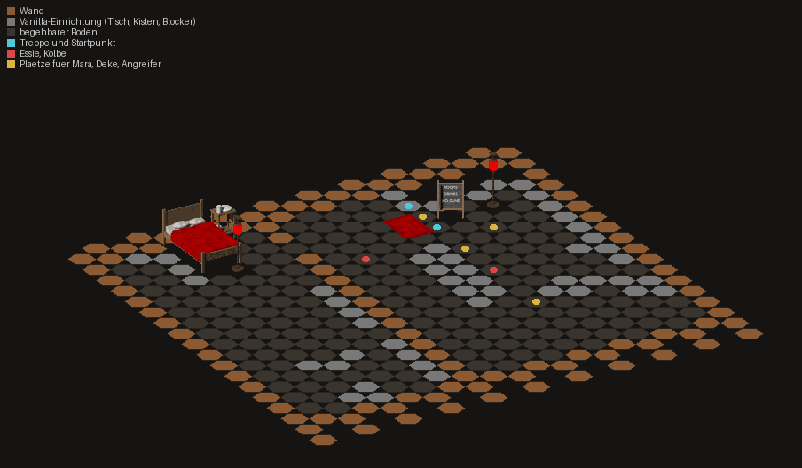

# Grafik 1 – Eigene Einrichtung für die Gosse

**Arbeitstitel:** *Rotlicht über dem Ödland* – Addon-Modifikation für Fallout 2
**Status:**
- Die Werkzeugkette ist fertig: Blender → PNG → FRM → Paket.
- Das erste Grafikpaket „Rotlicht“ steht in der Gosse: sechs Objekte aus elf Grafiken.
- Das Paket wird für RPU 2.4.34 und 2.3.34 gebaut und prüft sich selbst.
- **Im Spiel noch nicht gesehen.** Wie die Grafiken zwischen den Vanilla-Wänden wirken, zeigt erst der Test im Spiel (Abschnitt 8).

**Grundlage:** [Recherche: Neue Grafiken](recherche-grafik.md), Abschnitt 5 (Vorschlag, Schritte 1–3)

---

## 1. Was neu ist

| Datei | Inhalt |
|---|---|
| [`tools/frm.py`](../tools/frm.py) | FRM lesen und schreiben (byte-gleich an 30 RPU-Dateien geprüft), Palette, PNG ↔ FRM, Szenerie-Prototypen, Palette aus der eigenen `master.dat` |
| [`tools/grafik/geometrie.py`](../tools/grafik/geometrie.py) | Kamera und Maßstab der Engine: Hexfelder, Bodenkacheln, Welt ↔ Bild |
| [`tools/grafik/szene.py`](../tools/grafik/szene.py) | Blender-Szene: orthografische Kamera, Licht, Materialien mit Maserung, Stoff, Rost und Schmutz |
| [`tools/grafik/eichung.py`](../tools/grafik/eichung.py) | Eichung der Kamera an einer Vanilla-Bodenkachel und an der Größe der Figuren |
| [`tools/grafik/katalog.py`](../tools/grafik/katalog.py) | **Eine Quelle** für die eigene Szenerie: Namen, Texte, Material, belegte Felder, Plätze in der Gosse, Licht |
| [`tools/grafik/modelle.py`](../tools/grafik/modelle.py) | Die sechs Modelle in Blender |
| [`tools/grafik/rendern.py`](../tools/grafik/rendern.py) | rendert jedes Objekt: Bild, Leuchtmaske, Metadaten |
| [`tools/grafik/umwandeln.py`](../tools/grafik/umwandeln.py) | rechnet auf die Palette um, schneidet große Möbel in Streifen, schreibt `grafik/` |
| [`tools/szenerie.py`](../tools/szenerie.py) | baut die Grafiken ins Paket ein: Listen, Prototypen, Texte, Kartenobjekte; liest das fertige Paket gegen |
| [`tools/grafik/gosse_bild.py`](../tools/grafik/gosse_bild.py) | Vorschau der eingerichteten Gosse aus einem fertigen Paket |
| [`grafik/`](../grafik/) | Ergebnis im Repository: `frm/*.frm` (11 Grafiken), `stuecke.json`, `vorschau/*.png` |
| [`tools/bau_karten.py`](../tools/bau_karten.py) | Die Gosse bekommt die Einrichtung. Neue Wegeprüfung für die Karte |
| [`tools/paket.py`](../tools/paket.py) | Grafik- und Prototyplisten sowie `pro_scen.msg` je Release. Anleitung um Punkt 7 erweitert |

---

## 2. Das Paket „Rotlicht“



*Schematische Vorschau: Boden, Wände und Vanilla-Einrichtung sind nur angedeutet (das sind Grafiken des Originalspiels, die hier nicht vorliegen). Die eigenen Grafiken stehen pixelgenau so, wie die Engine sie setzt.*

| Objekt | Name im Spiel | Felder | Grafiken | Platz in der Gosse |
|---|---|---|---|---|
| Rote Laterne | Red lantern | 1 | `rllatern` (Glas in Farbe 254) | 17063 bei der Treppe, 18468 am Ende des Tischs; Licht 4 Felder, Stärke 40.000 |
| Bett | Bed | 2 × 3 | `rlbett0`–`rlbett3`, 2 Blocker | 17070, oben links, Kopf an der Rückwand |
| Paravent | Folding screen | 1 × 3 | `rlparav0`–`rlparav2` | 17068, rechts neben dem Bett |
| Waschtisch | Washstand | 1 | `rlwasch` | 16671, links neben dem Kopfende |
| Teppich | Rug | 1 (flach) | `rltepp` | 17269, vor dem Bett |
| Preistafel | Price board | 1 | `rlschild` („ROOMS / DRINKS / NO GUNS“) | 17065, neben dem Ankunftspunkt |

**Abweichung vom Vorschlag** in der Recherche: Statt Leuchtschild und Vorhang gibt es eine Preistafel mit Kreide, einen Waschtisch und einen Teppich.
- Ein Leuchtschild gehört an die Eingänge der Häuser, die auf Vanilla-Stadtkarten liegen. Das ist ein eigener Schritt.
- Ein Vorhang braucht eine Wand oder Tür, an der er hängt. In der Gosse gibt es dafür keinen passenden Platz.

Die Texte beim Untersuchen stehen im Katalog. Sie sind englisch und reines ASCII, zum Beispiel beim Teppich: *„A threadbare red rug. Someone has scrubbed a dark stain out of the middle, almost.“*

---

## 3. Die Werkzeugkette

```
<python mit bpy> tools/grafik/eichung.py <ausgabe>              # einmal: Kamera prüfen ("EICHUNG OK")
<python mit bpy> tools/grafik/rendern.py <render> [name ...]      # Blender: bild.png, leucht.png, meta.json
python3 tools/grafik/umwandeln.py <render> --palette color.pal    # -> grafik/frm, grafik/stuecke.json, grafik/vorschau
python3 tools/szenerie.py                                         # Selbstprüfung der Grafiken und des Einbaus
python3 tools/paket.py ...                                        # wie bisher; baut die Grafiken mit ein
python3 tools/grafik/gosse_bild.py <paket>/mods/rotlicht bild.png --palette color.pal
```

- **Blender** läuft als Python-Modul: `pip install bpy==5.0.1` in einer Umgebung mit Python 3.11. Es braucht keine Grafikkarte, Cycles rendert auf der CPU.
- **Pillow** wird für `umwandeln.py` und die Vorschauen gebraucht, für `paket.py` nicht.
- **Die Palette** (`color.pal`) gehört zum Originalspiel und liegt nicht im Repository. `python3 tools/frm.py palette <master.dat> color.pal` holt sie aus der eigenen Installation. Das Paket selbst braucht sie nicht: Die fertigen FRM-Dateien liegen im Repository.

### 3.1 Kamera und Maßstab

Gemessen an Vanilla-Grafiken (siehe `geometrie.py`):
- Eine Bodenkachel hat die Kanten (48, −12) und (32, 24) Pixel.
- Das passt zu einer orthografischen Kamera, die 25,66° nach unten blickt.
- Der Maßstab ist 43 Pixel je Meter. Ein Mensch von 1,75 m ist damit so hoch wie die RPU-Figuren.

`eichung.py` legt eine gerenderte Kachel über eine Vanilla-Kachel (Deckung 0,943) und misst eine 1,75 m hohe Säule (71 Pixel).

### 3.2 Farben

- Eigene Grafiken nutzen die festen Farben 1–228. Jeder Bildpunkt bekommt die nächste davon.
- Den Abstand misst `frm.py` im Lab-Farbraum. Mit einfachem RGB-Abstand kippte leicht graues Rot ins Braune.
- Stoffe spiegeln kaum (`glanz`), damit Rot rot bleibt.
- Leuchtende Flächen (das Laternenglas) rendert Blender in einem zweiten Durchgang als Maske. Diese Punkte bekommen **Farbe 254**, die die Engine rot pulsieren lässt.
- `schmutz` legt grobe, dunkle Flecken über jedes Material. Die Gebrauchsspuren lassen die Grafiken weniger sauber wirken als ein frisches Rendering.

### 3.3 Große Möbel

Die Engine zeichnet Objekte Feld für Feld von hinten nach vorn. Ein Bett als ein einziges Bild läge falsch über oder unter Figuren, die daneben stehen. Darum wird es in **senkrechte Streifen** geschnitten, wie beim RPU-Stockbett (`bedmilt6`–`8`):
- Die Schnitte liegen zwischen den Hexmitten.
- Jeder Streifen steht auf seinem vordersten Feld.
- Belegte Felder ohne eigenen Streifen bekommen einen unsichtbaren Blocker (Vanilla-Objekt „Secret Blocking Hex“).

`umwandeln.py` setzt die Streifen danach so zusammen, wie die Engine sie zeichnet, und bricht ab, wenn das Ergebnis nicht pixelgleich das Ausgangsbild ist.

---

## 4. Einbau ins Paket

Neue Szenerie braucht drei Einträge. `tools/szenerie.py` hängt sie an die Dateien des installierten Releases an, wie bei `scripts.lst`:

| Datei | Eintrag | Nummer |
|---|---|---|
| `art/scenery/scenery.lst` | `rlbett0.frm` usw. | FID = `0x02000000` + Zeile (ab 0) |
| `proto/scenery/scenery.lst` | `rlbett0.pro` usw. (Dateiname frei, kein Konflikt mit RPU-Nummern) | PID = `0x02000000` + Zeile (ab 1) |
| `text/english/game/pro_scen.msg` | Titel und Text | PID-Index × 100 und × 100 + 1 |

Die Nummern hängen von der Länge der Listen ab. Die Listen unterscheiden sich je Release:

| Release | Grafikliste vorher | unsere FIDs | Prototypen vorher | unsere PIDs |
|---|---|---|---|---|
| RPU 2.3.34 | 2.349 | 2.349–2.359 | 2.300 | 2.301–2.311 |
| RPU 2.4.34 | 2.383 | 2.383–2.393 | 2.334 | 2.335–2.345 |

Darum vergibt `paket.py` die Nummern erst beim Packen und reicht sie an den Bau der Gosse weiter. Die Prototypen sind generische Szenerie (Untertyp 5, 45 Byte, Aufbau wie `00000007.pro` des RPU):
- Flags wie bei Vanilla-Möbeln: Licht und Schüsse gehen durch, keine Transparenz.
- Der Teppich ist zusätzlich flach (wird vor allem anderen gezeichnet) und blockiert nichts.

**Ohne Paket** (`tools/build_scripts.sh`, Prüfwerkzeug) bleibt die Gosse wie bisher ohne Einrichtung. Die Skripte merken davon nichts.

---

## 5. Platzierung in der Gosse

Der Raum (Beckys Keller aus `denbus1`) liegt in den Reihen 82–96 und Spalten 61–71:
- Rückwände oben (Reihe 81) und rechts (Spalte 60).
- Die Treppe steht auf 16666.
- In der Mitte steht ein langer Tisch (Spalten 67–68, Reihen 87–91).
- An der rechten Wand stehen Kisten.

Die ersten Plätze waren nach dem Hexraster geraten und lagen teils auf Kisten und Kamerasperren. Die Prüfungen unten haben das gefunden. Die Plätze jetzt:
- **Bett, Paravent und Waschtisch** stehen oben links an der Rückwand, links von der Treppe.
- Die Treppe bleibt von drei Feldern aus erreichbar (16866, 16867, 16667).
- Zwischen Bett und Tisch bleibt der Gang in Reihe 86 frei.

Neue Prüfungen in `bau_karten.py` (laufen bei jedem Bau, mit und ohne Einrichtung):
- Kein Stück der Einrichtung steht auf einem Feld, auf dem schon etwas steht.
- Jedes Stück steht auf Boden und im Raum (ein Nachbarfeld ist vom Startpunkt aus erreichbar).
- Startpunkt, Essie, Kolbe, die Plätze für Mara, Deke und die Angreifer sowie die Treppe sind vom Startpunkt aus erreichbar.
- Die Einrichtung nimmt nur ihre eigenen Felder weg und schneidet keinen Teil des Raums ab. Eine Ausnahme ist ausdrücklich erlaubt: 16470, eine Nische in der Zickzack-Rückwand hinter dem Bett.

---

## 6. Prüfungen

| Prüfung | Wo | Ergebnis |
|---|---|---|
| FRM lesen und schreiben byte-gleich | 30 RPU-Grafiken, alle 11 eigenen | gleich |
| Prototyp wie RPU | `szenerie_pro` gegen `00000007.pro` | byte-gleich |
| Kamera | `eichung.py` | Deckung 0,943, Figur 71 px, „EICHUNG OK“ |
| Streifen ergeben das Bild | `umwandeln.py` | pixelgleich bei allen sechs Objekten |
| Grafiken im Repository | `szenerie.py`: jede Datei lesbar, eine Richtung, nur Farben 1–228 (254 nur bei Leuchtobjekten), Stücke und Blocker decken die Felder genau ab | OK |
| Einbau mit künstlichen Listen | `szenerie.py`: Liste ohne letzten Zeilenumbruch, Nummern, Texte | OK |
| Fertiges Paket gegenlesen | `szenerie.pruefe_paket` bei jedem `paket.py`-Lauf, für beide Releases: Grafikliste → FRM, Prototypliste → PRO (PID, FID, Textnummer, Untertyp), Texte in `pro_scen.msg`, jedes Objekt auf der Karte mit passender FID am erwarteten Feld | OK |
| Karte | Round-Trip byte-gleich, Wegeprüfung (Abschnitt 5) | OK |
| Gesamtlauf | Builds RPU 2.4.34 und 2.3.34 mit allen Tests, Unofficial Patch, beide Pakete | siehe Commit |

---

## 7. Grenzen

- **Die Wände vorn und links** (Reihe 97, Spalte 72) zeichnet die Engine über alles, was dahinter steht. Der Waschtisch steht direkt vor der linken Wand, das Bett ein bis zwei Felder daneben. Ob die Wand sie anschneidet, lässt sich ohne die Wandgrafiken nicht sicher sagen. Die Plätze sind je eine Zahl in `katalog.py`.
- **Licht** ist in Fallout nur hell oder dunkel, nicht farbig. Rot sind nur das pulsierende Glas und die Stoffe.
- **Stil:** Die Grafiken sind sauberer als die Vanilla-Möbel, die kräftigere Schatten und mehr Falten haben. Nachschärfen geht über Licht und Materialien in `szene.py`, danach neu rendern.
- **Nur eine Blickrichtung:** Szenerie hat in Fallout eine Ansicht. Ein gedrehtes Bett wäre ein neues Modell.
- **Grafiklisten:** Nach Szenerie ist noch viel Platz (über 1.700 Einträge frei). Bei Bodenkacheln sind es in RPU 2.4.34 nur 19 (die Zahl in der Recherche war zu hoch und ist korrigiert).

---

## 8. Testen im Spiel

Neues Spiel mit dem Testpaket, dann in die Gosse (F11 im Debug-Paket). Punkt 7 der `ANLEITUNG.txt`:

1. Erscheinen alle sechs Dinge? Fehlt etwas, oder steht irgendwo ein leeres Feld mit Blocker?
2. Passen Größe und Stil zu den Vanilla-Möbeln (Tisch, Kisten)?
3. Schneidet die linke Wand Bett oder Waschtisch an?
4. Eine Figur vor und hinter dem Bett entlanggehen lassen: Liegt dabei ein Teil des Betts falsch über ihr?
5. Pulsiert das Glas der Laternen rot, und hellen sie den Raum auf?
6. Untersuchen: Zeigen alle Objekte Namen und Text?
7. Absturz oder Fehlermeldung beim Betreten der Gosse?

Am besten mit Bildschirmfoto (F12) aus der Mitte des Raums.

---

## 9. Wie es weitergeht

Erst das Urteil aus dem Spiel. Danach, je nach Ergebnis:
- Plätze, Größe oder Stil nachziehen.
- Weitere Pakete mit derselben Werkzeugkette: Einrichtung der fünf anderen Häuser, Leuchtreklame an den Eingängen (Farbe 254 oder Feuerfarben), später eigene Endslides mit eigener Palette (siehe [Recherche](recherche-grafik.md), Abschnitt 4).
